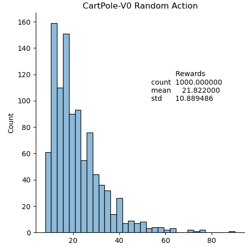
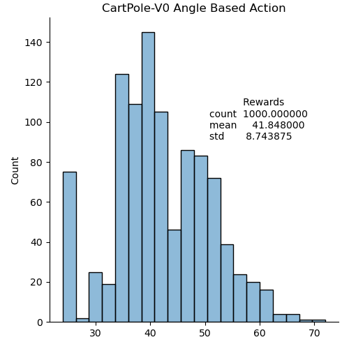
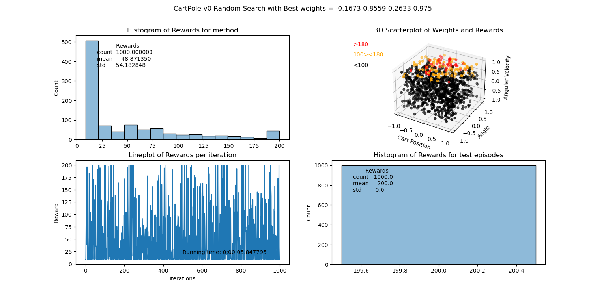
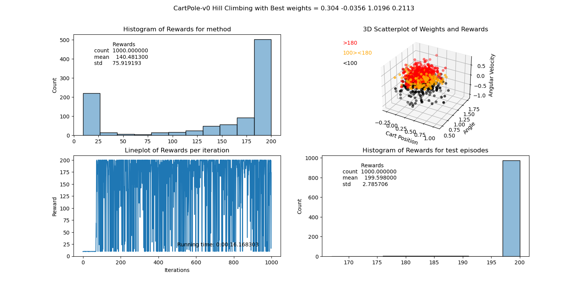
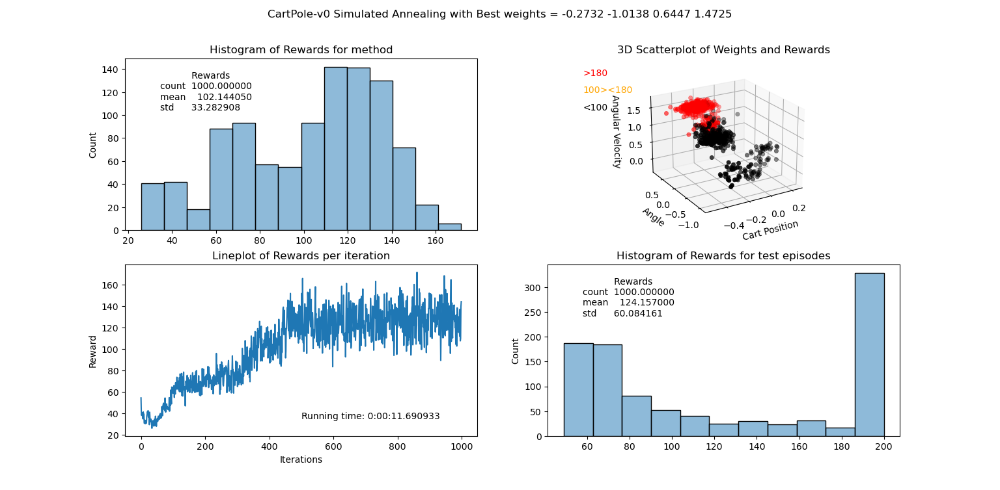
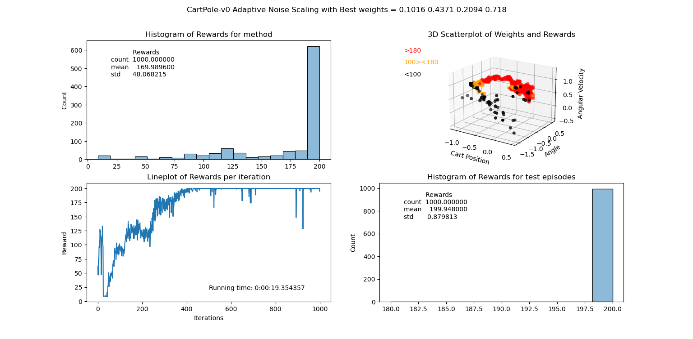
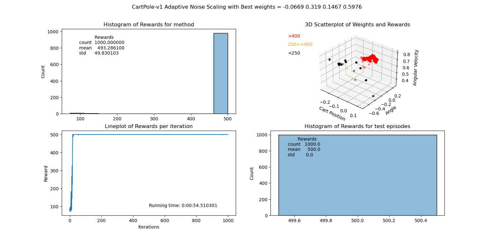

# RL_1_CartPole
## Solving the CartPole-v0 OpenAI
### 1.0 Introduction
- **Episode** = A sequence of interactions between an agent and its environment, starting from an initial state and ening at a terminal state.
- The agent and the environment interact at each timestep
- At each timestep, the agent receives an **observation** and a **reward** from the environment
- The agent chooses an **action** based on the observation
- The environment transitions to a new state and emits a new observation and reward
- The episode ends when a terminal state is reached
- The agent learns a policy, which is a mapping from observations to actions
- The goal of the agent is to maximize the total reward over the episode

### 1.1 Random action based control
As a first step we are taking random actions from the action space. These actions are pushing to the left (0) or right (1).
The average reward we get is **21.8 with a std of 10.9**. 
The histogram of the rewards is shown below.

### 1.2 Angle based action control
In this case we are taking actions based on the angle of the pole. If the angle is negative we push to the left (0) and if the angle is positive we push to the right (1).
Now we get an average reward of **41.8 with a std of 8.7**. We see that the average reward is bigger and the variation is smaller.
The histogram of the rewards is shown below.

### 1.3 Random Search based control
Instead of taking into account only the angle of the pole, we are now taking into account all parameters (cart position, cart velocity, angle of the pole, angular velocity of the pole).
We are using random weights for the parameters and we are taking actions based on a linear combination of the weights and parameters. If the result is positive we push to the right (1) and if the result is negative we push to the left (0).
Since we are using random weights, we can expect a large variation in the rewards. The average reward is **48.9 with a std of 54.2**. The best weights found are **-0.1673 0.8559 0.2633 0.975**.
The most importan variation variable is angular velocity of the pole. Then we have the angle of the pole in combination of the cart position. The least important variable is the cart velocity.
Weights above 0 for the angular velocity give the best rewards. This means that we need more pushes when the agular velocity is high and less pushes when the angular velocity is low.
The rewards for the testrun all gave 200.0 with a std of 0.0. Lucky shot?

In the plots below you can see following plots:
A title containing the method used and the best weights found by the method.
- A histogram of the average rewards over 1000 episodes
- A 3D scatterplot of the most important weights and a 3-colorscale of the average reward. [Black < 100 < Orange < 180 < Red]
- A lineplot of the average reward over 1000 episodes with the runningtime indicated as text
- A histogram of the rewards over 1000 episodes using the best weights from the used method (Random Search in this case).

### 1.4 Hill climbing
With Hill Climbing we take a random set of weights and we add a random noise to the weights. If the new weights give a better result, we keep the new weights. If the new weights give a worse result, we keep the old weights. We repeat this process until we find a set of weights that gives a good result.
*In the examplecode only one same noise value is added to all 4 weights. This gave a bad result. I have changed the code to add a different noise value to each weight. This way the exploration is maximised. This gave a much better result.*
The average reward is **140.5 with a std of 75.9**. The best weights found are **0.304 -0.0356 1.0196 0.2113**. 
The average reward is already much better than the previous methods. The variation is still high.
Performing this method multiple times gives different results. A lot depends on the initial weights. Since we need an angular velocity above 0 to get a good reward, we need to start with weights above 0 for the angular velocity. If we start with weights below 0 for the angular velocity, we need to move this weight above 0. This can take a lot of time with random noise.
The lineplot shows a small average reward in the first episodes. After 50 episodes the hill climbing kicks in and the average reward reaches all possible values (in a random way...). The best weights found are shown in the plots below.

### 1.5 Simulated Annealing
Simulated annealing adds chance of finding a better solution elsewhere. It reduces the posibility to end up in a local optimum. The chance of finding a better solution is reduced over time. This is called the temperature. The temperature is reduced over time. The temperature is reduced by a factor `cooling_rate`. The temperature is reduced by multiplying the temperature with `cooling_rate`. The temperature is reduced until it reaches a minimum temperature. The minimum temperature is reached after `n` iterations. The minimum temperature is the temperature at which the chance of finding a better solution is 0. The chance of finding a better solution is calculated by `exp((new_reward - old_reward) / temperature)`. The chance of finding a better solution is 0 if the new reward is equal to the old reward. The chance of finding a better solution is 1 if the new reward is higher than the old reward. The chance of finding a better solution is 0 if the new reward is lower than the old reward.
With this method we get an average reward of **180.6 with a std of 52.5**. The best weights are **-1.1149 1.9414 0.4607 1.7763**.
The average is higher and the variation is a lot smaller. Again the random nature of the weights and noise can give different results. Sometimes it doesn't have one average reward above 100 and sometimes almost all results are above 100. The best weights found are shown in the plots below. This is also the first time the lineplot has something meaningfull to tell. Based on this lineplot I have adjusted the parameters to get a better result (smaller variation in rewards).

### 1.6 Adaptive noise scaling
During the experiments I found an optimal spread of 0.4, that is why I kept the spread between 0.1 and 0.8. The Lineplot shows we get a optimal result after 400 episodes. Now and then we get a worse result but the next episodes the optimal weights are found again. The average reward is **170.0 with a std of 48.1**. The best weights are **0.1016 0.4371 0.2094 0.718**.
Although the average is lower, the lineplot shows a more stable result. 
The best weights found are shown in the plots below.
In this 3D scatterplot the extra orange color shows the path the algorithm took to find the best weights. Together with the lineplot this gives a good idea of how the algorithm works.

### Recap of the results
| Method  | Average reward  | Std  |  Best weights |
| --- | --- | --- | --- |
| Random action based control  | 21.8  | 10.9  |  - |
| Angle based action control  | 41.8  | 8.7  |  - |
| Random Search based control  | 48.9  | 54.2  |  -0.1673 0.8559 0.2633 0.975 |
| Hill Climbing  | 140.5  | 75.9  |  0.304 -0.0356 1.0196 0.2113 |
| Simulated Annealing  | 180.6  | 52.5  |  -1.1149 1.9414 0.4607 1.7763 |
| Adaptive noise scaling  | 170.0  | 48.1  |  0.1016 0.4371 0.2094 0.718 |

### 1.7 Extensions and conclusions
*How do the different search algorithms compare to or differ from each other in  terms of rewards and computational efficiency?*
In every step along the way there is improvement in the average reward. The Hill climbing takes away the randomness of the search, the simulated annealing moves away from local optima and the adaptive noise scaling reduces the fallback to worse results.

In terms of computational efficiency it is difficult to say which method is best. The most computational time is taken by the calculations of the steps taken. The better the method, the more steps are taken and the more computational time is needed.
Since no higher/CPU consuming calculations are needed, the computational time is not a big issue. Simulated annealing found the shortest route to optimal values. Therefore it took the longest time to run.

*Check if you can colve the cartpole-vi environment.*
The same script was used for the CartPole-V1 environment. The results are shown below.

*Does it make sense to increase the number of observation variables by deriving new observations from the existing ones?*
In my opinion it does make sense to derive more linear derivatives from the observation variables. It increases the space in which an optimal solution can be found and it would take the correlation between the variables into account. This would make the search for optimal weights harder and more time consuming and less possible to visualise. But it would give the algoritm more freedom to find a better solution.

*Is it possible to solve the MountainCar-v0 environment with these search based optimization techniques?*

