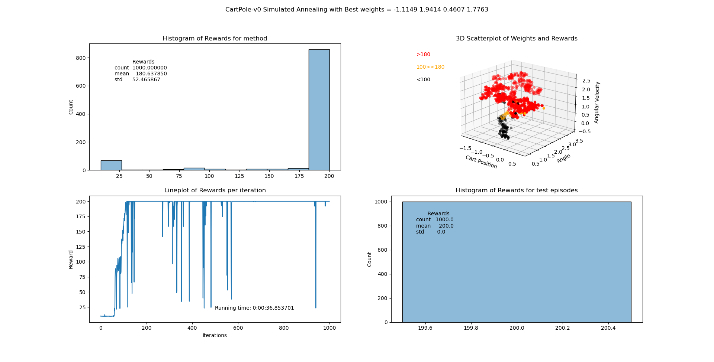

# RL_1_CartPole
## Solving the CartPole-v0 OpenAI
### 1.0 Introduction
- **Episode** = A sequence of interactions between an agent and its environment, starting from an initial state and ening at a terminal state.
- The agent and the environment interact at each timestep
- At each timestep, the agent receives an **observation** and a **reward** from the environment
- The agent chooses an **action** based on the observation
- The environment transitions to a new state and emits a new observation and reward
- The episode ends when a terminal state is reached
- The agent learns a policy, which is a mapping from observations to actions
- The goal of the agent is to maximize the total reward over the episode

### 1.1 Random action based control

### 1.2 Angle based action control

### 1.3 Random Search based control

### 1.4 Hill climbing

### 1.5 Simulated Annealing

### 1.6 Adaptive noise scaling

